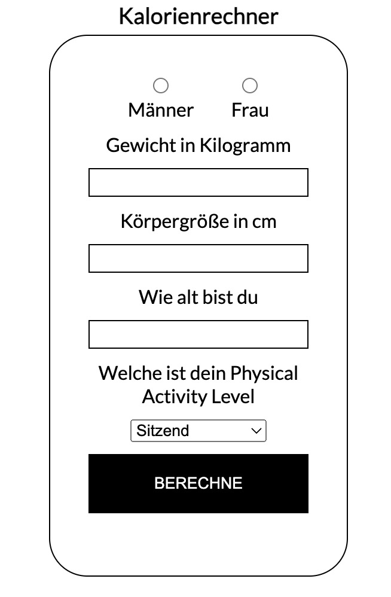

# Kalorienrechner

Die Harris-Benedict-Formel ist eine Gleichung, bei der Größe, Gewicht, Alter und Geschlecht einer Person zur Berechnung ihres Grundumsatzes herangezogen werden. Bei bestimmten Personen reicht die Berechnung über die Formel nicht aus, da diese Formel die fettfreie Körpermasse und das Verhältnis von Muskeln zu Fett nicht berücksichtigt.

Um die Harris-Benedict-Formel zu verwenden, müssen Sie den Grundumsatz Ihres Kunden bestimmen und dann einen Aktivitätsfaktor anwenden, um eine geschätzte Zahl für seinen täglichen Kalorienbedarf zu erhalten.

Schritt 1: Grundumsatz (Basal Metabolic Rate - BMR) bestimmen
Männer: BMR = 66 + (13.7 x Gewicht in Kilogramm) + (5 x Körpergröße in cm) – (6.8 x Alter in Jahren)

Frauen: BMR = 655 + (9.6 X Gewicht in Kilogramm) + (1.8 X Körpergröße in cm) – (4.7 x Alter in Jahren).

Schritt 2: Multiplizieren Sie den BMR-Wert mit dem entsprechenden PAL-Wert (Physical Activity Level)
Sitzend –wenig oder keine Bewegung (BMR x 1,2)

Leicht aktiv –leichte körperliche Aktivität/Sport 1-3 Tage/Woche (BMR x 1,375)

Mäßig aktiv – moderate körperliche Aktivität/Sport an 3-5 Tagen/Woche (BMR x 1,55)

Sehr aktiv – starke körperliche Aktivität/Sport an 6-7 Tagen/Woche (BMR x 1,725)

Sehr stark aktiv – sehr starke tägliche körperliche Aktivität/Sport oder 2X tägliches Training (BMR x 1,9)
## Authors

- [@StefanAiroaie](https://www.github.com/StefanAiroaie)

## Use

https://github.com/StefanAiroaie/Kalorienrechner

## Screenshots

